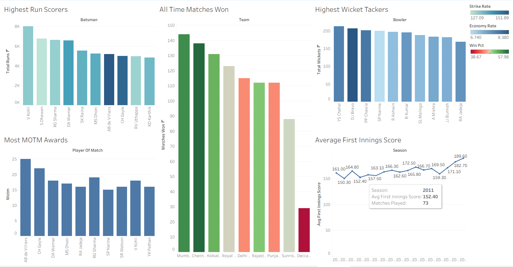

#  IPL Analysis Dashboard

**Tools:** MySQL · Tableau  
**Dataset:** IPL match & delivery data (2008–2022) | 950+ matches · 200,000+ deliveries

---

##  Objective

Analyzed IPL match and ball-by-ball data to uncover performance patterns across batsmen, bowlers, teams, and match conditions, and visualized the findings in an interactive Tableau dashboard.

---

## Dataset

The dataset used consists of two seperate CSV files : matches and deliveries. These files contain the information of each match summary and ball by ball details, respectively. Source: [IPL complete dataset-Kaggle](https://www.kaggle.com/datasets/patrickb1912/ipl-complete-dataset-20082020/data?select=deliveries.csv)

##  Dashboard Preview

🔗 **[View Live Tableau Dashboard](https://public.tableau.com/views/ipl_analysis_17734882889330/IplAnalysis?:language=en-US&publish=yes&:sid=&:redirect=auth&:display_count=n&:origin=viz_share_link)**

---

##  Key Insights

- **Mumbai Indians** lead all-time wins with 140+ matches, with a win rate only lower than arch rivals Chennai Super Kings.
- **Virat Kohli** is the highest run-scorer by a ~1,200 run margin over the next batter.
- **Average first innings scores have risen steadily** from ~150 (2008) to ~189 (latest season), reflecting the evolution of T20 batting.
- **YS Chahal** leads all-time wicket takers, with DJ Bravo and PP Chawla close behind
- **AB de Villiers** tops the MOTM awards chart, underscoring his match winning consistency over the years.
- Teams choosing to **field after winning the toss** have a marginally higher win rate which could show the impact dew has or the pressure of scoreboard.

---

##  SQL Queries Overview

| # | Query | Purpose |
|---|-------|---------|
| 1 | All-time wins by team | Win count + win % per team (≥50 matches) |
| 2 | Toss impact | Win rate after batting vs fielding decision |
| 3 | Top 10 batters | Total runs, fours, sixes, strike rate |
| 4 | Top 10 bowlers | Total wickets + economy rate |
| 5 | Venue analysis | Batting first vs chasing win % by venue |
| 6 | Season scoring trends | Avg first innings score per season |
| 7 | Most MOTM awards | Player-level MOTM counts |
| 8 | Powerplay runs | Avg powerplay runs by batting team |

---

##  Data Cleaning Highlights

- Standardized historical team name changes: `Royal Challengers Bangalore → Bengaluru`, `Kings XI Punjab → Punjab Kings`, `Delhi Daredevils → Delhi Capitals`
- Handled `NULL` values in `result_margin`, `target_runs`, and `target_overs` (originally stored as `'NA'` strings)
- Excluded non-standard dismissals (`retired hurt`, `obstructing the field`) from bowler wicket counts
- Excluded wides from strike rate calculations for accurate batter stats

---

##  Setup Instructions

1. Import `matches.csv` and `deliveries.csv` into MySQL using `LOAD DATA INFILE`
2. Run `ipl_analysis.sql` to create the schema, clean data, and execute all queries
3. Export query results as CSVs and connect to Tableau
4. Open the Tableau workbook or view the live dashboard via the link above

---

## 👤 Author

**Suraj Shetty**  
🔗 [LinkedIn](https://linkedin.com/in/suraj-shetty-ss080103) · [GitHub](https://github.com/Suraj-Shetty08)
